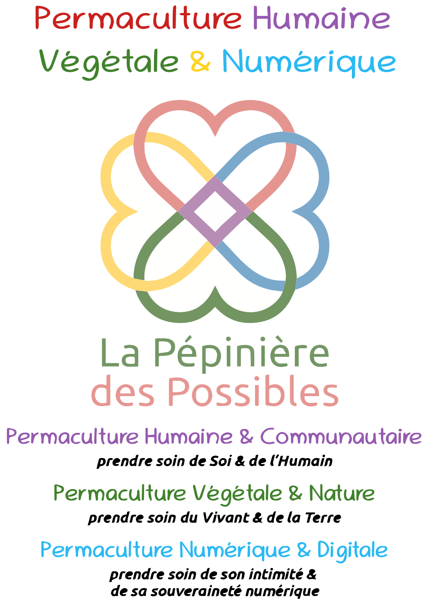

# La Permaculture numérique
# pour une intimité et souveraineté numérique

Sabrina Bailly
pour la Pépinièrre des Possibles

---
# Volet numérique de la Permaculture

Une éthique de Vie basée sur 3 principes fondamentaux 

- Prendre soin de l'humain
- Prendre soin de la Terre
- Redistribuer & partager les ressources

---
# Prendre soin de l'humain

- Eviter les outils du capitalisme de surveillance (GAFAM)
- Favoriser les logiciels libres et open source
- Repenser les usages : la technologie au service le l'huamisn et non l'inverse
- Vigilance réseaux sociaux  (addiction, harcelement, deconnection du réel.. )

---
# Prendre soin de la Terre

- Favoriser le matériel revalorisé
- vigilance sur la quantité de donnés stockée sur l'ordi de quequ'un d'autre (le nuage ou drive)
- résolution photos et vidéso (mise en ligne , visionnage..)

---
# Redistribuer & partager les ressources

- Culture libre
- Communs numériques

---
# Le Libre ou open source 

---

# Usages

* partage d’informations
* lien social
* diffusion d'événements
* communication associative/ professionnelle

# Défis & Dangers

* Capitalisme de surveillance
* Bulle de filtre
* Prédation 
* Santé
* Dépendance et enfermement
---

# Réseaux propriétaires

Issus notamment des géant du web (GAFAM)

* Meta: facebook, instagram, whatsapp, threads
* X (ex-twitter)
* Youtube (Google)
* Instagram
* TikTok
* Snapchat
* LinkedIn
* Pinterest
* Babelio
---

# Le Fedivers-e

* Mot valise composé de fédération et univers 
* Mots clé: interopérabilité , décentralisation
* Un ecosystème de serveurs interconnectés, (fédérés) hébergeant des logiciels libres  de réseaux sociaux communiquant par des protocoles  ouverts.
* Un fonctionnement différent de réseaux sociaux traditionels; des instances communiquant entre elles plutôt que un géant qui utilise toutes vos données.
* Tout le monde peut héberger son instance du/des réseau(x) de son choix (avec quelques compétences techniques;). Les hébérgeurs actuels le sont souvent par militantisme pour un internet libre et éthique.
---

Une piste à suivre pour un internet du futur en accord avec l’idéologie à l’origine du Web?

---

# Quelques réseaux du Fedivers

* Mastodon: 	microblogging 				alternative à X (twitter) 
* Peertube:	hébérgement de vidéos 		alternative à Youtube
* Mobilizon:	publication d'événements 	alternative aux événements Facebook 
* PIxelFed:	publication d'images			alternative à Instagram
* Castopod		diffusion de podacast		alternative à SoundCloud,Spotify,Anchor, Acast 
* Bookwyrm:	critique littéraire 			alternative à Babelio/GoodReads  
* Diaspora:								alternative à Facebook 

Itopie propose des instances de Mastodon, Peertube et Mobilizon à ses coopérateurices.

---

# Mastodon 

logiciel de réseau social de microblog auto-hébergé, libre, distribué et décentralisé via ActivityPub

[Rejoindre Mastodon](https://joinmastodon.org/fr)
[Mastodon d'Itopie](https://mastodon.inubo.ch/about)

---

# Merci 

Contact :

bienvenue@LaPepiniereDesPossibles.org

 
